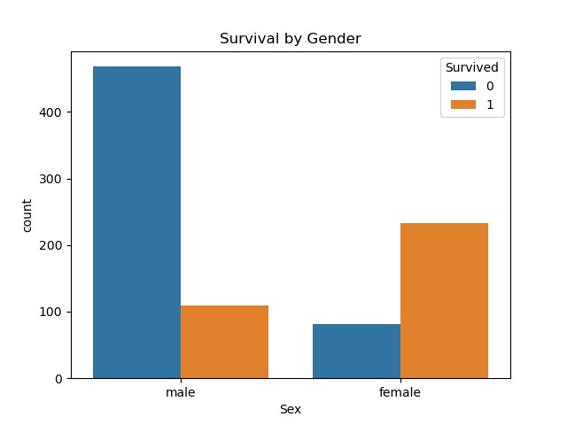
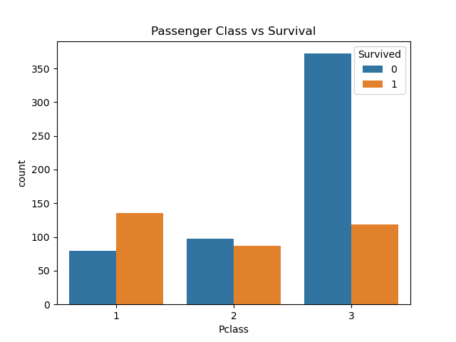
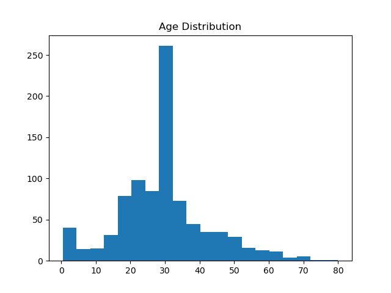

# PRODIGY_DS_02

## 📌 Internship Track
Data Science Internship at Prodigy InfoTech

---

## 📊 Task Objective
To perform data cleaning and exploratory data analysis (EDA) on the Titanic dataset to identify patterns, relationships, and trends in the data.

---

## 📁 Dataset
Titanic Dataset (Provided by Prodigy InfoTech)  
The dataset contains information about passengers such as age, gender, class, fare, and survival status.

---

## 🧹 Data Cleaning
- Handled missing values in **Age** using mean
- Filled missing values in **Embarked** using mode
- Dropped **Cabin** column due to excessive missing data

---

## 📈 Exploratory Data Analysis (EDA)

The following analyses were performed:

- **Survival Count Analysis**
- **Survival by Gender**
- **Survival by Passenger Class**
- **Age Distribution**
- **Fare Distribution**

---

## 🔍 Key Insights

- Majority of passengers **did not survive**
- **Female passengers** had a significantly higher survival rate
- **First class passengers** had better survival chances
- Most passengers were **adults**
- Fare distribution shows that **most passengers paid lower fares**

---

## 🛠 Tools & Technologies
- Python
- Pandas
- Matplotlib
- Seaborn

---

## 📊 Sample Visualizations

---

## 📂 Project Structure
PRODIGY_DS_02/

│

├── data/

│ └── titanic.csv

│

├── notebooks/

│ └── task2_analysis.ipynb

│

├── outputs/

│ ├── survival_count.png

│ ├── gender_survival.png

│ ├── class_survival.png

│ ├── age_distribution.png

│ └── fare_distribution.png

│

└── README.md

---

## ✅ Conclusion

EDA revealed that gender and passenger class significantly influenced survival rates. This analysis demonstrates how data can uncover meaningful patterns and support decision-making.

---

## 👤 Author
Gokul S
